# Food-Lover

**Login Page** 
This is the first page that appears as soon as the webpage is loads. 
Anyone who has already registered can login. If not they can click register that redirects them to the registration form.  
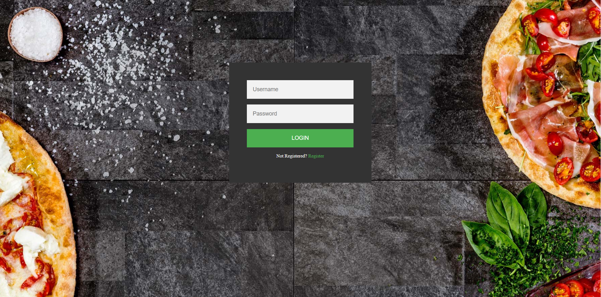  

**Registration Page** 
This is the registration form. Anyone can register by providing their details as specified. 
After registeration, they are redirected to the login page as above. During registration, the user has to specify a unique username.  
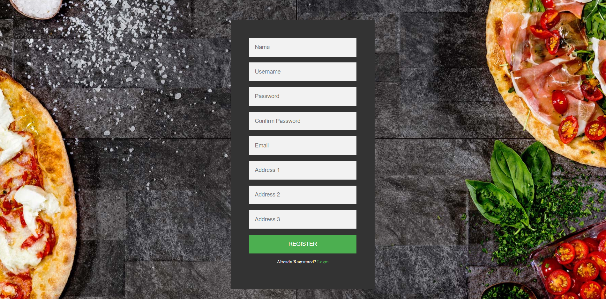  

**Incorrect username or password. Register if not registered yet ALERT** 
This alert appears if you try to login before registering. 
This also appears if you provide the username or password during login.  
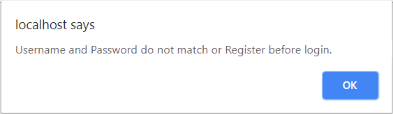  

**Home Page** 
This is the main page of the website. It gives the overview of the website on what it does. 
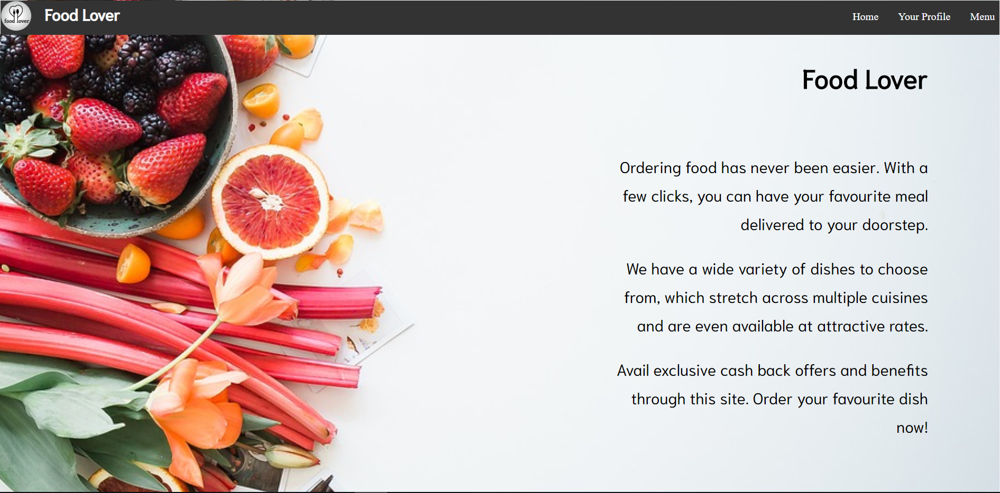  

**Profile Page** 
This page displays the details of the user and gives an option to the user to edit their user information that they had provided earlier during registration. 
It also includes the user's order history and their current status.  
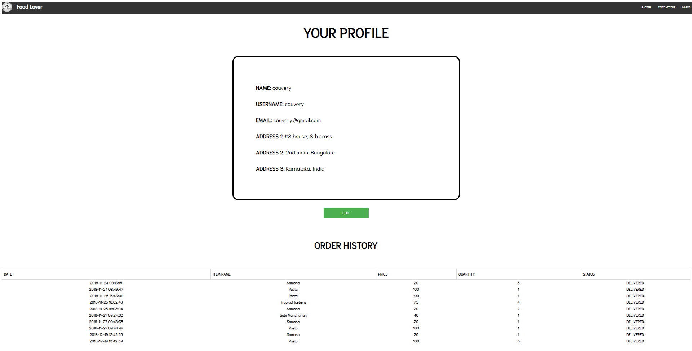  

**Edit Profile Page** 
It allows you to edit your information and save the changes.  
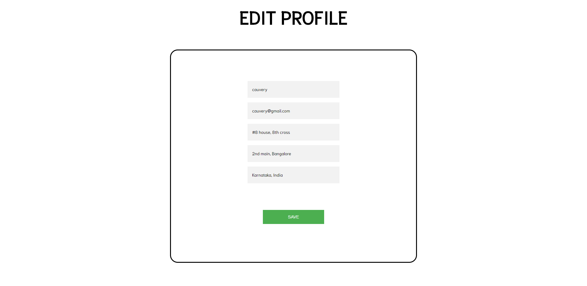  

**Profile Updated ALERT** 
The alert is displayed when the user information is updated.  
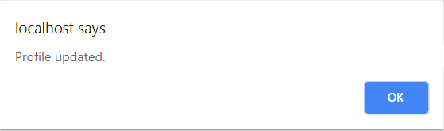  

**Wallet Page** 
This displays the current balance in your wallet. The wallet initially initializes with 500Rs.  
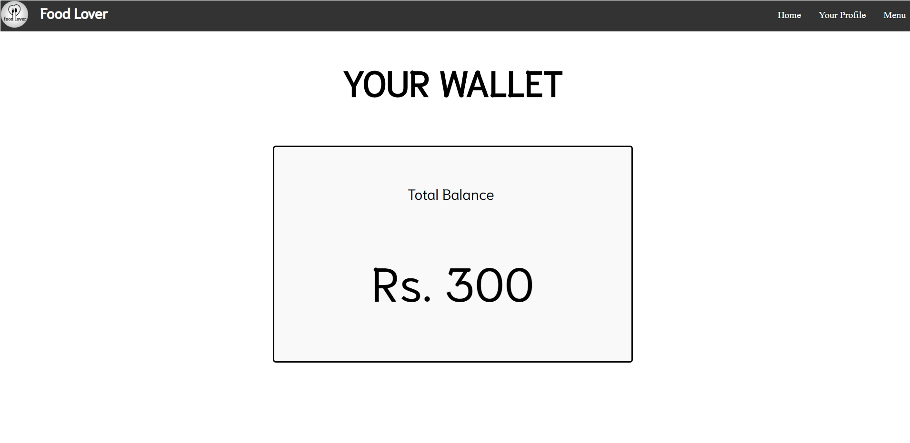  

**Menu Page** 
It has all the food items that are in the menu along with the price and the averyage rating provided by all users. 
There is a checkout button that takes you to the cart.  
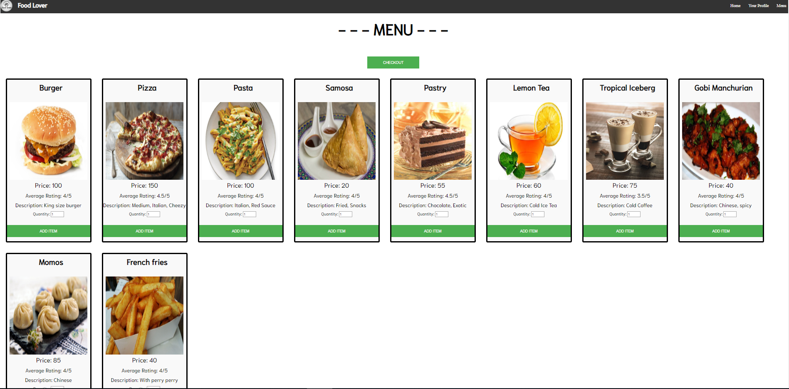  

**Item added ALERT** 
The alert shows that the specified item has been added to the cart.  
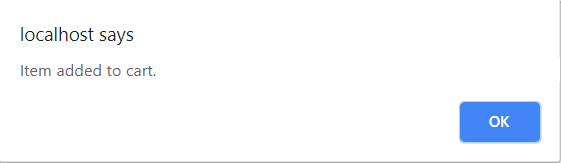  

**Cart Page** 
All the items chosen by the user with the quantity and the total (quantity * price) of the list of items is displayed. 
There are 2 buttons in the page - one for cancelling the order and the other to confirm the order.  
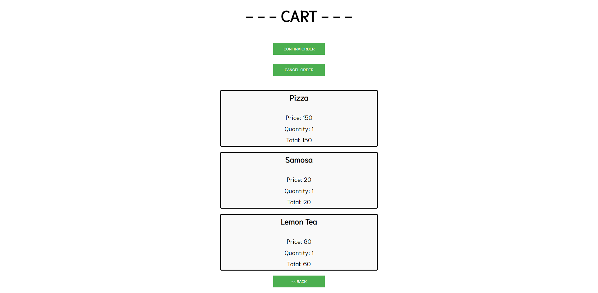  

**Order Cancelled ALERT** 
When the user cancels the order, this alert is displayed.  
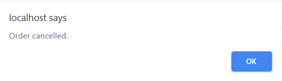  

**Order Confirmation Page**
Here the user can choose the payment option (wallet or cash on delivery) and confirm the order.  
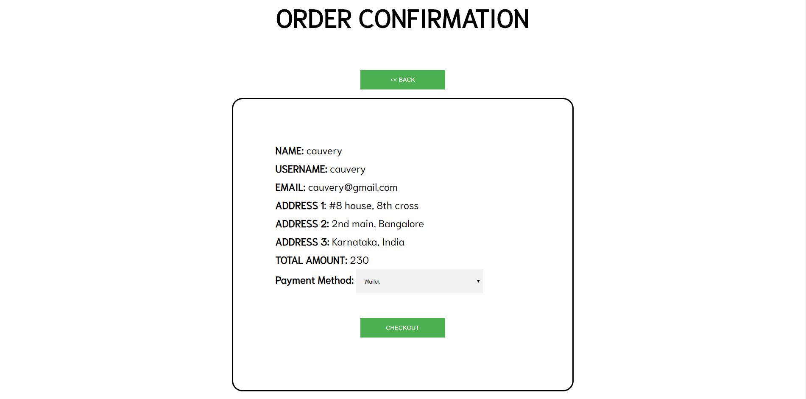  

**Order Confirmed ALERT** 
When the user confirms his order, this alert is displayed.  
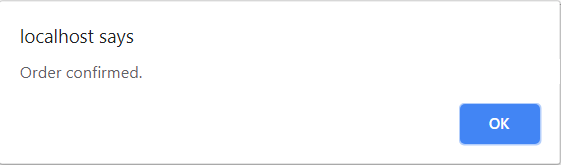  

**Wallet Update ALERT** 
When the user chooses to pay with the wallet, and if the wallet has enough balance, the wallet balance is decremented by the total order value.  
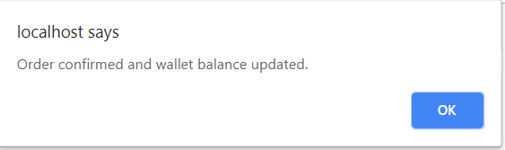  

**Food Rating Page** 
This page has only those items that the user recently ordered and have already received the food but have not rated the food.  
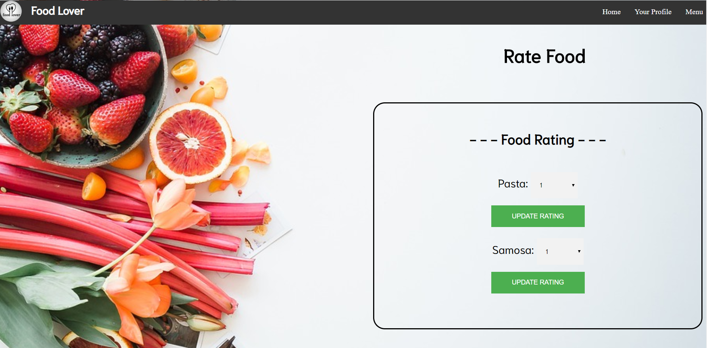  

